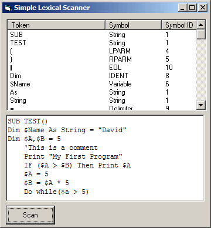



## DM Simple Lexical

### Description

Hi made this in the hope that it may be of some use to any one,

that wanted to know how to write a Basic Lexical.

The meain Reason I made it was to build a small simple Compiler,

But you may use it for a scripting lanuage or anything you want.

Well I Hope you like it.
 
### More Info
 

             |
---                |---
**Submitted On**   |2006-03-29 01:50:12
**By**             |[dreamvb](https://github.com/Planet-Source-Code/PSCIndex/blob/master/ByAuthor/dreamvb.md)
**Level**          |Beginner
**User Rating**    |5.0 (15 globes from 3 users)
**Compatibility**  |VB 3\.0, VB 4\.0 \(16\-bit\), VB 4\.0 \(32\-bit\), VB 5\.0, VB 6\.0
**Category**       |[String Manipulation](https://github.com/Planet-Source-Code/PSCIndex/blob/master/ByCategory/string-manipulation__1-5.md)
**World**          |[Visual Basic](https://github.com/Planet-Source-Code/PSCIndex/blob/master/ByWorld/visual-basic.md)
**Archive File**   |[DM\_Simple\_1983753292006\.zip](https://github.com/Planet-Source-Code/dreamvb-dm-simple-lexical__1-64838/archive/master.zip)

